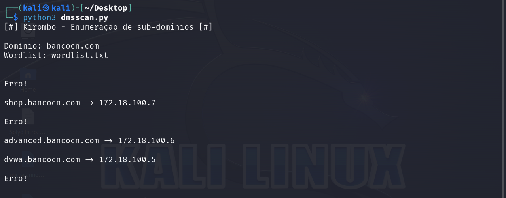

# Kirombo - Enumeração de sub-domínios

Ferramenta para enumeração de sub-domínios com wordlist implementada feita em Python.

## Solyd - Introdução ao Hacking e Pentest 2.0

Fiz esse projeto de acompanhamento para a aula de número 6 no curso da Solyd de [Introdução ao Hacking e Pentest 2.0](https://solyd.com.br/treinamentos/introducao-ao-hacking-e-pentest-2/). Ferramenta básica só para enumeração de sub-domínios com implementação de wordlist.

### Requisitos

Requisitos necessários para o funcionamento da ferramenta.
- [Python](https://www.python.org/)
- [Biblioteca: dnspython](https://www.dnspython.org/)

### Instalação

Instalação rápida só clonar repósitorio para qualquer host e executar com o Python.

Clonando a repo:

    git clone https://github.com/Kirombo/kirombo-dnscan.git

Instalando requisitos:

    python3 -m pip install -r requirements.txt

Depois só executar script que tudo vai no automático:

    python3 dnscan.py

## Autor

  - **Kirombola** - *Desenvolvedor* -
    [Kirombo](https://github.com/Kirombo/)

## Licença

Projeto está sob a [licença MIT](LICENSE).
